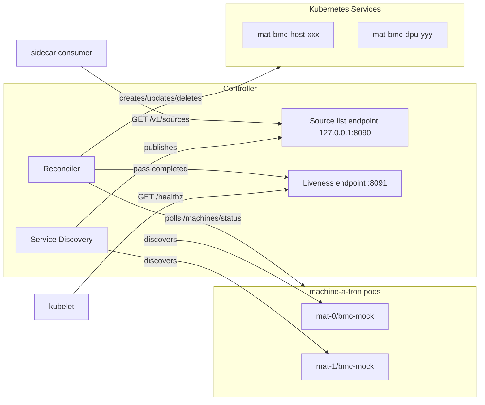

# Machine-a-tron Kubernetes Controller

Kubernetes controller that auto-discovers machine-a-tron pods and creates
Services for mock BMC endpoints.

## Features

- Auto-discovers machine-a-tron pods via `nvidia-infra-controller/mat-service=true`
  label
- Creates ClusterIP Services with BMC IP for each mock BMC; a host or DPU
  that has not reported a BMC IP yet gets its Service once the IP is known
- Supports Redfish (TCP 443), IPMI (UDP 623), and per-machine SSH ports
- IPMI and SSH ports are dynamically added when machine-a-tron reports their endpoints in status
- Creates a ClusterIP Service with the NVOS IP for each simulated NVLink switch
  once it has one, forwarding the NMX-C port (TCP 9370) to machine-a-tron's
  hosted NMX-C mock
- Multi-pod deployments with pod-specific routing
- Automatic cleanup of stale Services
- Publishes the discovered machine-a-tron identities over a pod-local
  HTTP endpoint for sidecar containers (see [Source list endpoint](#source-list-endpoint))
- Serves a liveness endpoint on the pod network for the kubelet (see
  [Liveness endpoint](#liveness-endpoint))

## Build

```bash
docker build -f dev/k8s/machine-a-tron-controller/Dockerfile -t mat-k8s-controller:latest .
kind load docker-image mat-k8s-controller:latest --name <cluster>
```

## Configuration

| Flag | Env Var | Default | Description |
|------|---------|---------|-------------|
| `--namespace` | `NAMESPACE` | `nico-system` | Kubernetes namespace |
| `--discovery-selector` | `DISCOVERY_SELECTOR` | `nvidia-infra-controller/mat-service=true` | Label selector for discovery |
| `--sync-interval` | `SYNC_INTERVAL` | `30s` | Reconciliation interval |
| `--target-selector` | `TARGET_SELECTOR` | `app.kubernetes.io/name=nico-machine-a-tron` | Pod selector for Services |
| `--insecure-skip-verify` | `INSECURE_SKIP_VERIFY` | `false` | Skip TLS verification (dev only) |
| `--log-level` | `LOG_LEVEL` | `info` | Log level |
| `--kubeconfig` | `KUBECONFIG` | (empty) | Path to kubeconfig (dev only, uses in-cluster config if empty) |
| `--source-list-addr` | `SOURCE_LIST_ADDR` | `127.0.0.1:8090` | Listen address for the source list endpoint; must be a loopback IP address (empty disables it) |
| `--source-list-debounce` | `SOURCE_LIST_DEBOUNCE` | `5s` | Minimum age of a changed source set before a later discovery pass publishes it with a new `generation` (`0` publishes at once) |
| `--health-addr` | `HEALTH_ADDR` | `:8091` | Listen address for the liveness endpoint `GET /healthz` on the pod network (empty disables it) |
| `--health-stale-after` | `HEALTH_STALE_AFTER` | `10m` | How long the reconcile loop may go without completing a pass before `/healthz` reports a stall (`0` disables the check) |
| `--enable-state-annotations` | `ENABLE_STATE_ANNOTATIONS` | `false` | Include machine state annotations (`mat-api-state`, `mat-power-state`) on Services; causes frequent updates in large deployments |

An environment variable that is set is the flag's default, an empty value
included: `SOURCE_LIST_ADDR=""` disables the source list endpoint just like
`--source-list-addr=`. A flag on the command line overrides the variable.

### Owner References

The controller automatically sets an ownerReference on each created Service,
pointing to the machine-a-tron Deployment that the Service routes traffic to.
This enables Kubernetes garbage collection - when a machine-a-tron Deployment
is deleted (e.g., when a pod is removed from Helm values or the release is
uninstalled), the Services routing to it are automatically cleaned up.

The owner Deployment is derived from the discovered Service name by stripping
the `-bmc-mock` suffix (e.g., `nico-machine-a-tron-mat-0-bmc-mock` →
`nico-machine-a-tron-mat-0`).

### Port Discovery

The controller automatically derives the bmc-mock API port from the discovered
Kubernetes Service. It looks for a port named `redfish` or `bmc-mock` in the
Service spec, falling back to the first available port. This eliminates the
need for manual port configuration and ensures the controller always uses the
correct port defined in the Service.

## Source list endpoint

The controller holds the Kubernetes API credentials. Containers that share
its pod, such as a protocol gateway that fronts every machine-a-tron instance,
learn about the instances through a small HTTP endpoint instead of talking to
the API server themselves.

The endpoint is **pod-local and unauthenticated**: it binds to `127.0.0.1`
by default, the controller refuses to start when `--source-list-addr` is not
a loopback IP address, and it must not be exposed through a Service. It is
served for the lifetime of the controller and shuts down gracefully with it.

### Contract (v1)

`GET /v1/sources` returns `200 application/json`:

```json
{
  "generation": 3,
  "ready": true,
  "sources": [
    {
      "name": "nico-machine-a-tron-mat-0-bmc-mock",
      "base_url": "https://nico-machine-a-tron-mat-0-bmc-mock.nico-system.svc.cluster.local:8443",
      "pod": "mat-0"
    }
  ]
}
```

| Field | Type | Meaning |
|-------|------|---------|
| `generation` | uint64 | Increments only when the set of `(name, base_url)` pairs changes (add, remove or URL change). Starts at `0` before the first discovery and restarts from `0` with the controller process; see [Generation semantics](#generation-semantics). |
| `ready` | bool | `true` once the first successful discovery completed. Stays `true` afterwards, including when the set becomes empty. |
| `sources[].name` | string | Machine-a-tron identity: the discovered bmc-mock Service name. |
| `sources[].base_url` | string | `https://<svc>.<ns>.svc.cluster.local:<port>`, the same URL the controller polls for `/machines/status`. |
| `sources[].pod` | string | Machine-a-tron pod name from the `nvidia-infra-controller/pod-name` label, or empty. |

`sources` is always a JSON array (never `null`) and is sorted by `name`.

`GET /v1/healthz` returns `200 text/plain` with body `ok\n` while the
controller is serving. `HEAD` is accepted on both paths; other methods return
`405`, other paths `404`.

### Generation semantics

A change to the source set is published with a new `generation` once a later
discovery pass, at least `--source-list-debounce` (default `5s`) after the
change was first seen, reports the same set. Discovery is the only observer,
so the clock alone never publishes: a Service that is missing from one pass
and back on the next is never published, and several changes between two
passes arrive as one generation step. Setting the debounce to `0` publishes a
change with the pass that first sees it. Pod name changes (a pod restart
behind the same Service) update `sources[].pod` in place without bumping the
generation. The first successful discovery is published immediately so
consumers waiting for `ready` are not delayed by the debounce.

Discovery runs once per `--sync-interval` (default `30s`), so a change reaches
the endpoint with the pass that confirms it, at most two intervals after it
happened with the default debounce. A failed discovery pass leaves the last
published set in place.

The counter is held in memory. A controller restart publishes
`generation = 0, ready = false` with an empty list until the first discovery
completes and then republishes whatever it found as generation `1`, whether or
not the set changed while the controller was down. The generation is therefore
a change hint, not an identity of the set: consumers that must react to fleet
changes compare the `(name, base_url)` set they started with against the
current list and use the generation for logging only. That is what
`mat-protocol-gateway` does (see `crates/mat-protocol-gateway/README.md`,
"Epoch model"); it ignores `ready = false` responses, keeps running when the
same set reappears under a new generation, and exits only when the set
differs.

The reference JSON shape is checked in as
[`pkg/sourcelist/testdata/sources_v1.json`](pkg/sourcelist/testdata/sources_v1.json).
It is the cross-language contract fixture: `TestHandler_SourcesGolden`
asserts that the Go handler's response is JSON-equal to it, and the Rust
gateway's contract tests (`crates/mat-protocol-gateway/tests/integration/source_list_contract.rs`)
include the same file and check that the gateway types carry exactly its
fields, so a change to the JSON shape fails on whichever side was not updated.

## Liveness endpoint

`GET /healthz` on `--health-addr` (default `:8091`, every interface) answers
`200 text/plain` with body `ok\n` while the controller is alive, and `503`
with the reason once the reconcile loop has not completed a pass for
`--health-stale-after` (default `10m`). The first pass is granted the same
bound from process start. The bound is deliberately far above
`--sync-interval`: a full pass at scale creates thousands of Services under
the client rate limit, and the probe must not restart a controller that is
merely busy. `HEAD` is accepted; other methods return `405`, other paths
`404`.

This is the endpoint a `livenessProbe` for the controller container should
target. It carries no data and needs no credentials. The
loopback source list endpoint keeps its own `/v1/healthz`, which the kubelet
cannot reach (`127.0.0.1` inside the pod); that one only tells a container in
the same pod that the source list is being served.

## Helm Deployment

Enable in parent chart:

```yaml
mat-k8s-controller:
  enabled: true
  image:
    pullPolicy: Never  # For local images
  config:
    insecureSkipVerify: true  # Only for dev with self-signed certs
```

## Service Structure

Created Services have:

**Labels:**

- `app.kubernetes.io/managed-by: mat-k8s-controller`
- `nvidia-infra-controller/mat-id: <uuid>`
- `nvidia-infra-controller/mat-machine-type: host|dpu|nvos`
- `nvidia-infra-controller/pod-name: <pod>` (multi-pod)

**Annotations:**

- `nvidia-infra-controller/mat-bmc-ip`
- `nvidia-infra-controller/mat-api-state` (when `--enable-state-annotations=true`)
- `nvidia-infra-controller/mat-power-state` (when `--enable-state-annotations=true`)
- `nvidia-infra-controller/mat-hardware-type`
- `nvidia-infra-controller/mat-ipmi-listen-port` (when `bmc.ipmi` reported in status)
- `nvidia-infra-controller/mat-ssh-listen-port` (when `bmc.ssh` reported in status)

**Ports:**

- `redfish` (TCP) - Always present for Redfish API access
- `ipmi` (UDP) - Present only when machine-a-tron reports `bmc.ipmi` in status
- `ssh` (TCP) - Present only when machine-a-tron reports `bmc.ssh` in status

### Switch NVOS Services

A device with `device_kind: switch` and an `nvos_ip` in status additionally
gets a `mat-nvos-<id>` Service whose ClusterIP is the NVOS IP, labelled
`mat-machine-type: nvos` and annotated `nvidia-infra-controller/mat-nvos-ip`.
Its single port, `nmxc` (TCP 9370), targets the same bmc-mock listen port as
the BMC Service: NICo resolves a rack's NMX-C controller from a switch's NVOS
address, and machine-a-tron's hosted NMX-C mock answers on its bmc-mock
listener, selecting the rack by the address the request was sent to. The NVOS
(underlay) DHCP segment must lie inside the cluster's ServiceCIDR, as the BMC
segment already must.

## Development

```bash
make build
make test
make run KUBECONFIG="$HOME/.kube/config"
```

## Troubleshooting

### ClusterIP already allocated

BMC IP is outside ServiceCIDR or already in use.

**Solutions:**

1. Reserve a ServiceCIDR for machine-a-tron (K8s 1.29+)
2. Use a CIDR within the cluster's ServiceCIDR
3. Delete conflicting Services

### ClusterIP change detected

BMC IP changed but ClusterIP is immutable. Controller will delete and recreate
the Service.

## Architecture


