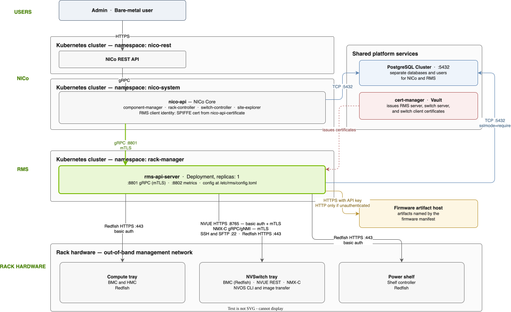

# Rack Management Service (RMS) Backend

NICo delegates rack-level hardware operations to the **Rack Management Service (RMS)**, a
separate service that owns the protocols each device class speaks. NICo decides *what* should
happen to a rack and RMS carries it out against compute trays, NVSwitch trays, and power
shelves.

This page explains the shape of that integration: the service boundary, the deployed
components, the transports and trust between them, and the RMS APIs NICo depends on. For the
settings that turn the integration on, refer to
[RMS Configuration](../../configuration/rms.md).

## The Challenge

A single NVL rack presents several hardware management protocols at the same time. Compute
trays, power shelves, and NVSwitch tray BMCs speak Redfish. NVSwitch trays also speak NVUE
REST, the NVOS CLI over SSH, and image transfer over SFTP. A rack-wide firmware update has
ordering rules between component classes, device reboots, and partial-failure states. RMS
reports these as one outcome rather than as several dozen independent device calls.

Building that into NICo would put per-vendor hardware protocol handling inside the service
that also owns tenancy, provisioning, and network isolation. RMS exists so that boundary stays
clean: NICo keeps the site-level lifecycle, and one service behind a single gRPC API absorbs
the hardware protocol surface.

## How the Integration Works

### Service Boundary

| Concern | Owner |
| --- | --- |
| Rack, machine, and tenant lifecycle; inventory of record | NICo |
| Deciding when a rack enters maintenance and what to apply | NICo |
| Selecting the firmware manifest for a rack profile | NICo |
| Translating a request into Redfish, NVUE, SSH, SFTP, gRPC, and gNMI calls | RMS |
| Per-device ordering, retries, and job aggregation | RMS |
| Downloading firmware artifacts named by the manifest | RMS |

NICo builds an RMS client only when the site configuration supplies `[rms] api_url`. Without
it, NICo Core still starts, but an RMS-backed Component Manager cannot initialize. Its RPCs
return configuration errors.

### Deployed Components

RMS runs as its own Deployment in its own namespace, alongside NICo rather than inside it:

- **`rms-api-server`** runs in the **`rack-manager`** namespace and is reached through a
  ClusterIP Service of the same name. Port `8801` serves the gRPC API and port `8802` serves
  Prometheus metrics at `/metrics`. The RMS chart's `ServiceMonitor` is disabled by the NICo
  site values and enabled by `setup.sh` only with `--with-observability`. Sites can instead
  configure an OpenTelemetry Collector to scrape the endpoint. When collectors run as a
  DaemonSet, shard the target so only one collector scrapes it and duplicate samples are not
  produced. The RMS API Deployment does not define Kubernetes liveness or readiness probes.
- **Replica count is one.** RMS does not yet share state between replicas, so a load-balanced
  deployment can return inconsistent results.
- **Runtime configuration** is a single TOML file the container reads at startup from
  `/etc/rms/config.toml`.
- **Persistence** uses a database and user separate from NICo's on the same PostgreSQL cluster,
  which keeps RMS migrations, permissions, and restore decisions independent of NICo's.
- **Certificates** come from the same cert-manager issuer that signs NICo's own certificate,
  which is what lets the two services complete mutual TLS without extra configuration.

### Transport and Trust

Credential-bearing connections crossing a trust boundary are authenticated. The mechanism
differs by hop:

| Connection | Transport | Authentication |
| --- | --- | --- |
| NICo Core to RMS | gRPC on port `8801` | Mutual TLS |
| RMS to compute tray BMC and HMC | Redfish over HTTPS | HTTP basic authentication |
| RMS to power shelf controller | Redfish over HTTPS | HTTP basic authentication |
| RMS to switch NVUE REST API | HTTPS on port `8765` | HTTP basic authentication and mutual TLS |
| RMS to switch NVOS CLI and image transfer | SSH and SFTP on port `22` | SSH credentials |
| RMS to switch NMX-C | gRPC and gNMI | Mutual TLS |
| RMS to firmware artifact host | HTTPS when sending an API key; HTTP permitted only for unauthenticated downloads | Optional artifact API key, set by the manifest |
| RMS to PostgreSQL | PostgreSQL over TCP on port `5432` | Password from a Kubernetes Secret, TLS required |

NICo does not need a dedicated RMS client certificate. The RMS client library discovers
NICo's own SPIFFE certificate mount and presents it to RMS, and because the RMS server
certificate is minted from the same issuer, both directions verify. Supplying explicit
certificate paths is an override for sites that want different material.

### RMS APIs NICo Calls

NICo uses a focused slice of the RMS API. Each call belongs to a specific workflow:

| Workflow | RMS APIs |
| --- | --- |
| Rack maintenance firmware upgrade | `apply_firmware_object`, `get_firmware_job_status` |
| Component Manager firmware update | `apply_firmware_object`, `get_firmware_job_status`, `get_node_firmware_inventory`, `list_firmware_objects` |
| Switch system image update | `apply_switch_system_image`, `get_switch_system_image_job_status` |
| Power control | `batch_set_power_state`, `get_job_status` |
| Switch certificate installation | `configure_switch_certificate`, `get_configure_switch_certificate_job_status` |
| NVLink fabric configuration | `configure_scale_up_fabric_manager_v2`, `get_job_status`, `batch_get_scale_up_fabric_service_status` |
| Machine slot and tray enrichment | `batch_get_node_device_info` |
| Switch password rotation and decommissioning | `update_switch_system_password`, `batch_reset_switch_factory_default` |

Firmware, image, certificate, and fabric calls are asynchronous. RMS returns a job identifier
immediately and NICo polls the matching status API until the job reaches a terminal state.
Treat accepted, queued, and in-progress as nonterminal.

### How a Firmware Manifest Reaches RMS

Firmware updates use a standardized firmware manifest. This JSON document names firmware
components and the locations of their artifacts. The manifest travels from NICo configuration
to RMS in four steps:

1. A rack profile declares where its manifest lives, through
   `[rack_profiles.<id>.firmware_object] url`.
2. When a rack begins a firmware upgrade, NICo resolves the profile for that rack. A rack
   profile without a `firmware_object` source skips the automatic firmware update rather than
   failing.
3. NICo fetches the document from its HTTPS URL within the configured timeout and confirms it
   parses as a JSON object. The body is capped at 16 MiB because the manifest carries metadata,
   not firmware binaries. NICo does not verify the manifest with a signature or digest.
4. NICo sends the document body **inline** to RMS as the `config_json` field of
   `apply_firmware_object`, alongside the rack identifier, the resolved node set, the firmware
   and hardware types. Automatic profile-driven maintenance has no caller token: rack firmware
   submits no token and the backend substitutes the `NOAUTH` value, while the NVOS path sends
   `NOAUTH` directly. An explicit maintenance request instead loads and sends its stored
   artifact access token.

RMS then reads the artifact URLs from the manifest body that NICo forwarded and downloads the
artifact payloads itself. The payloads do not pass through NICo. The artifact host must
therefore be reachable from the RMS namespace.

## Key Insights

- **RMS is a backend, not a dependency of record.** NICo remains the inventory owner. RMS is
  selected per component class, so a site can route compute trays through RMS while another
  class uses a different backend.
- **The integration is config-gated at both ends.** NICo builds no RMS client without
  `[rms] api_url`, and RMS accepts no NICo traffic without matching TLS material.
- **Asynchronous by default.** Every consequential RMS operation returns a job identifier
  rather than a result, and correctness depends on polling to a terminal state.
- **Manifests flow through NICo; artifacts do not.** NICo hands RMS the document and RMS
  fetches the binaries, so artifact reachability is an RMS-side network requirement.
- **Shared PostgreSQL, separate database.** RMS persists to the same cluster as NICo under its
  own database and user, which keeps lifecycle decisions independent.

## Related

- [RMS Configuration](../../configuration/rms.md) — the NICo settings that enable and tune this integration
- [Rack state machine](../state_machines/rackstatemachine.md) — where rack maintenance calls into RMS
- [Switch certificate configuration](../state_machines/switch_configure_certificate.md) — the switch mTLS workflow
- [RMS external architecture](https://docs.nvidia.com/rms/documentation/architecture/external-view) — RMS northbound and southbound interfaces
- [RMS documentation home](https://docs.nvidia.com/rms/documentation/home) — deployment, operations, and hardware compatibility
