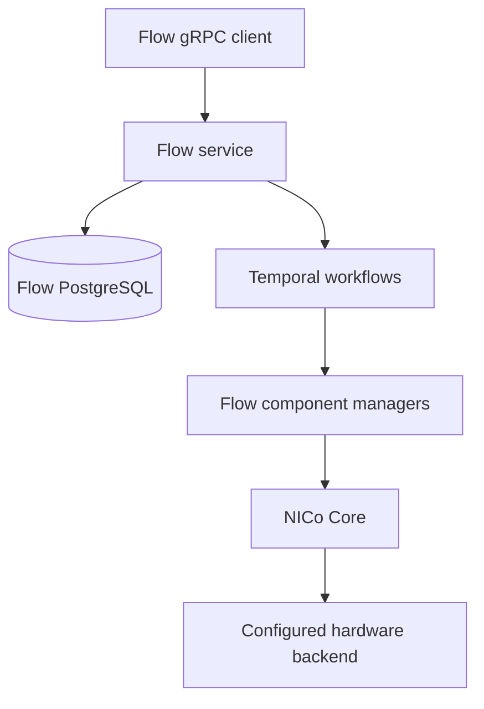

# NICo Flow

Flow provides rack inventory and durable orchestration for power control, firmware updates, ingestion, and bring-up. It groups component targets by rack so each rack has its own task and execution status.

## Service boundaries

Flow accepts gRPC requests, resolves inventory and operation rules, persists tasks in PostgreSQL, and runs tasks through Temporal. Its component managers call NICo Core for hardware operations. Core selects the backend that performs those operations, including RMS where configured.

[Flow component-manager configuration](../configuration/flow-component-manager.md) selects Flow implementations and providers. [Core RMS configuration](../configuration/rms.md) controls the downstream Core layer.

## Inventory and execution

| Concept | Responsibility |
| --- | --- |
| Rack and component | Identify hardware and its rack membership. |
| NVLink domain | Group racks into a logical domain. |
| Task | Track one rack's operation and Temporal execution. |
| Operation rule | Define ordered stages, component steps, actions, and verification. |
| Task schedule | Persist an operation and rack scope for recurring or one-time dispatch. |
| Operation run | Freeze selected rack targets and execute a firmware rollout in phases. |

The task manager resolves a request into rack tasks. The resolved operation rule is included in workflow input. Temporal runs rule stages in order and steps within a stage in parallel; component-manager activities perform the external calls. A failed stage stops the task without rolling back earlier hardware actions.

Task schedules and operation runs persist their own orchestration state in Flow's database. Their dispatchers submit tasks to the task manager. The internal job scheduler also runs service jobs such as inventory synchronization; it is separate from user-defined task schedules.

See [Flow Operations](../operations/flow/overview.md) for operator workflows and the [implementation reference](../development/flow/flow-internals.md) for package and storage details.

## Persisted firmware authentication

| Variable | Description | Default |
|----------|-------------|---------|
| `FLOW_DATA_ENCRYPTION_KEY_PATH` | Path to the base64-encoded 32-byte key used to protect persisted sensitive Flow data | Unset; the Helm chart mounts a key automatically |

Flow encrypts firmware authentication data before task, schedule, operation-run,
or Temporal persistence. Ciphertext envelope version 1 records the encryption
key's non-secret SHA-256 fingerprint so a mismatched key fails explicitly. The
AES-GCM additional authenticated data provides firmware-authentication domain
separation and authenticates the envelope version and key ID. It does not bind
an entire envelope to a particular database row or Temporal execution; database
authorization and integrity controls must prevent replay or relocation of a
complete envelope. The scope of
[issue #4392](https://github.com/dsx-ai-factory/infra-controller/issues/4392) uses one
preserved key and does not provide a key-rotation operation.

When `FLOW_DATA_ENCRYPTION_KEY_PATH` is unset, Flow starts with a warning and
continues to serve operations that do not contain firmware authentication data.
Requests with non-empty `authentication_data` fail with `FailedPrecondition`
before Flow persists or submits the operation. If the variable is set but its
file is unreadable, empty, or does not contain a valid key, Flow fails at
startup. Existing encrypted operations also require the original key when their
final firmware-control activity executes. Operators can enable encryption later
by configuring a persistent key and restarting Flow before submitting firmware
authentication data.

## Developer references

- [Local development and service startup](https://github.com/dsx-ai-factory/infra-controller/blob/main/rest-api/flow/README.md)
- [Component manager extension points](https://github.com/dsx-ai-factory/infra-controller/blob/main/rest-api/flow/docs/component-manager-architecture.md)
- [Internal scheduler](https://github.com/dsx-ai-factory/infra-controller/blob/main/rest-api/flow/docs/scheduler-architecture.md)
- [Generated Flow gRPC reference](https://github.com/dsx-ai-factory/infra-controller/blob/main/rest-api/flow/docs/grpc-api.md)
