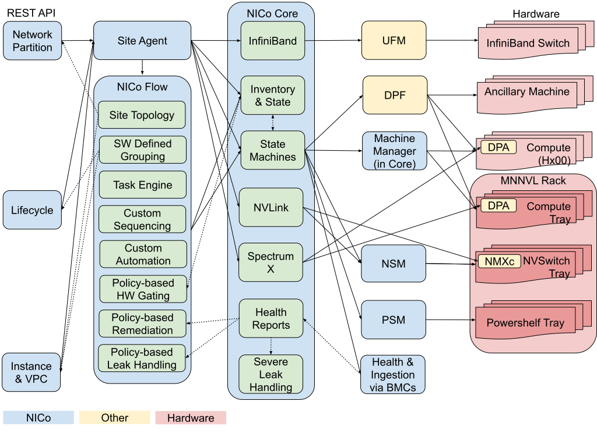
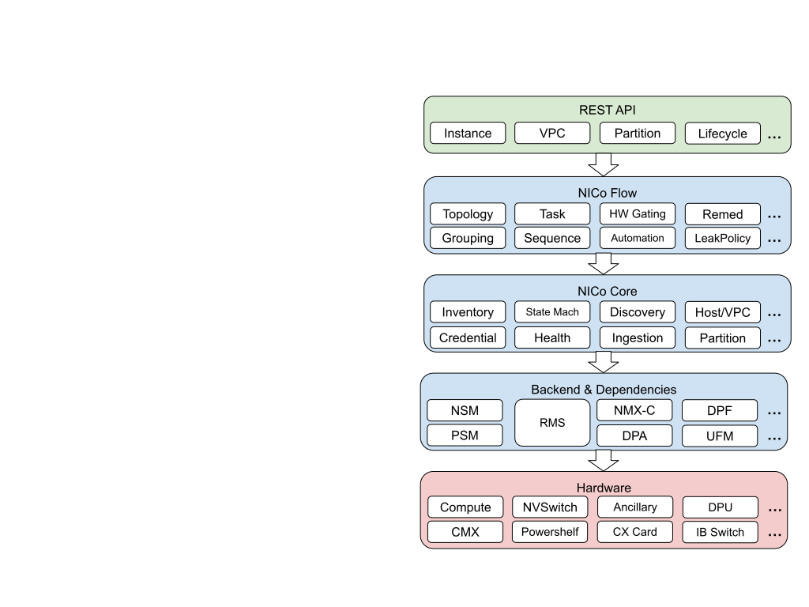

# Rack-Level Administration

NICo allows site administrators to manage bare metal for NVIDIA Multi-Node NVLink (MNNVL) systems such as GB200, providing the necessary rack-level topology, operations, and automation needed for hardware lifecycle management and resource provisioning.

NICo supports the rack component ("tray") grouping schema with topology and location for rack, NVLink domain, and future larger rack grouping units such as row, scalable unit, and super pods. It manages the following components on GBx00 racks:

- Compute tray
- NVSwitch tray
- Powershelf tray

NICo provides APIs and automated workflows to manage these components for the following core lifecycle management task categories:

- Inventory management with topology and location
- Firmware management with NVLink domain firmware consistency
- Power management with dependency and sequencing

## Dependencies

In order to use rack-level administration features today, NICo deployment needs to include NICo Flow, NSM, and PSM, properly configured with the REST API, site agent, temporal workflow, and NICo Core. The following diagram shows the control and data flows within NICo services and dependencies.

## Architecture

The end-to-end service path for NICo rack-level administration goes in the following order between services.

**HW Lifecycle REST API \-\> NICo Flow \-\> NICo Core \-\> Component HW Backend**

* **HW Lifecycle REST API**: NICo provides all rack-level administration operations via a set of HW Lifecycle REST APIs. Besides providing inventory, bringup, validation, power control, and firmware update functionalities for racks and trays (rack components), it supports referencing racks using the DCIM-supplied rack ID (e.g., “A12”) and referencing trays using rack-based tray addressing (e.g. “Rack A12 Tray Slot 19” or “Rack A12 Compute Tray \#3”), in addition to using tray serial numbers or BMC MAC addresses. It also exposes the task sequences running, pending, or completed on racks and trays, and allows cancellation. Non-rack compute machines are also supported.

* **NICo Flow**: The REST APIs are supported via NICo Flow, which is a NICo software component (discrete service) that uses NICo Core APIs to orchestrate hardware operation sequences and automate hardware operations, with user defined customization via dynamic rules and policies, in order to scale both operation of AI-factory hardware and the evolution of AI-factory software stack, by abstracting the topology and details of the mechanics of updates, maintenance, and responding to state changes in the datacenter.

NICo Flow contains software-defined states for managing a site, such as those for task and workflow, user customizable operation sequence and automation, as well as user-defined policies such as those for HW gating (preventing risky conditions in HW automation), remediation (dealing with broken or degraded HW or services), and leak handling.

* **NICo Core**: NICo Flow calls NICo Core service to perform the actual HW management operations. NICo Core is the original main NICo service that provides all the critical features for bare metal management, such as HW inventory and credential management, discovery and ingestion, state machines for power control and firmware update of component HW, managed host and VPC resource, and HW health reports. NICo Core contains all hardware-defined states for component HW and state-based automations.

* **Backend**: Previously, NICo Core accessed machines directly via BMC. With rack-scale systems, we now have more types of component HW (compute, switch, and powershelf), as well as more ways to access these components (BMC and NVUE). The complexity of these HW access and management operations are now moved out of NICo Core into the backend for NICo. NICo backend is an extensible interface for different types of hardware to be plugged into and managed by NICo.

Today there is a NVSwitch Manager (NSM) backend and a Powershelf Manager (PSM) backend, providing access to switch and powershelf trays in racks, called from NICo Core.

In the near future, NVIDIA Rack Manager Service (RMS) will be shipped as a backend for NICo to provide unified compute, switch, and powershelf trays access and management, as well as optimized default HW sequencing for rack power control and firmware update.

## Rack-Level Operations

### 1. Expected Inventory

NICo needs to be loaded with the expected rack equipment inventory to be managed. In most cases, the information should be available from a DCIM service.

The expected inventory often contain the following information:

* **NVLink Domain**
  * ID/Name
  * Description
  * Racks in the domain
* **Rack**
  * ID/Name
  * Vendor
  * Model
  * Serial Number
  * Location
  * Description
  * Trays in the rack
* **Tray**
  * ID
  * Type
  * Vendor
  * Model
  * Serial Number
  * In-rack information, including the rack ID, slot number, and tray index
  * Description
  * SKU, including firmware-updatable devices in the tray

### 2. Inventory Bringup

After NICo imports the expected inventory, it goes through the following workflow to discover and ingest the trays and bring up the rack and NVLink domain.

1. NICo discovers compute, switch, and powershelf trays via DHCP requests.
2. NICo explores these trays and ingest them for management.
3. The site administrator tells NICo to start the rack bringup.
4. NICo waits for and verifies that all compute, switch, and powershelf trays have been discovered and ingested, updates their FW to achieve consistency and compatibility, and perform the required power control sequence to ready the use of the rack components.
5. Once all the components are ready, the rack is considered *ready*.

### 3. Actual Inventory and Validation

NICo monitors the discovered and ingested trays and racks. It reports the actual inventory with dynamic information such as power status and installed firmware versions. It also compares the actual inventory against the expected inventory, and reports on any discrepancies (e.g. wrong rack installed, wrong slot installed, or wrong serial number).

### 4. Power Control

NICo provides power control for racks as well as arbitrary groupings of trays in racks, following predefined or customized power operation sequences.

**Sample Rack Power On Sequence:**

1. Power on power shelves.
2. Wait for all compute and switch trays to show up in NICo (via DHCP and BMC exploration).
3. [Future, **Configurable**] Perform leakage detections on all trays in the rack which are liquid cooled. If any leakage is detected, pause (or cancel) the operation.
4. Power on the switch tray hosts.
5. Power on the compute tray hosts.

**Sample Rack Power Off Sequence**

1. Power off the compute tray hosts and wait for all to be off.
2. Power off the switch tray hosts and wait for all to be off.
3. Power off the power shelves and wait for all to be off.

### 5. Firmware Management and Upgrade

NICo provides firmware update management for racks as well as arbitrary groups of trays in racks, following predefined or customized firmware update operation sequences.

**Sample Rack Firmware Update Sequence**

1. Perform firmware update on power shelves and wait for all to finish successfully.
2. Reboot power shelves and wait for all to be back online.
3. Perform firmware update on switch trays and wait for all to finish successfully.
4. Reboot switch trays and wait for all to be back online.
5. Perform firmware update on compute trays and wait for each to finish successfully.
6. Reboot compute trays and wait for all to be back online.

When a rack FW update completes successfully, all compute trays in the rack will have the same firmware version, all switch trays in the rack will have the same firmware version, and the compute tray firmware and switch tray firmware are supposed to be compatible with each other.

## REST API

Currently, NICo only supports GB200 NVL72 racks, where a rack and a NVL domain overlaps precisely. Hence, domain endpoints are currently not exposed and rack endpoints should be used. This will change in the future.

### Rack Endpoints

- [GET /v2/org/{org}/carbide/rack](https://docs.nvidia.com/infra-controller/rest-api-reference/api-reference/rack/get-all-rack): Retrieve all racks in the specified site.  
- [GET /v2/org/{org}/carbide/rack/{rack_id}](https://docs.nvidia.com/infra-controller/rest-api-reference/api-reference/rack/get-rack): Retrieve a rack with the specified ID.  
- [GET /v2/org/{org}/carbide/rack/validation](https://docs.nvidia.com/infra-controller/rest-api-reference/api-reference/rack/validate-racks): Validate components of all racks in the specified site by comparing the expected inventory data to the actual inventory data.  
- [GET /v2/org/{org}/carbide/rack/{rack_id}/validation](https://docs.nvidia.com/infra-controller/rest-api-reference/api-reference/rack/validate-rack): Validate components of the specified rack by comparing the expected inventory data to the actual inventory data.  
- [PATCH /v2/org/{org}/carbide/rack/power](https://docs.nvidia.com/infra-controller/rest-api-reference/api-reference/rack/power-control-racks): Control power of all or selected racks in the site. Supported power states are `on`, `off`, `cycle`, `forceoff`, `forcecycle`.  
- [PATCH /v2/org/{org}/carbide/rack/{id}/power](https://docs.nvidia.com/infra-controller/rest-api-reference/api-reference/rack/power-control-rack): Control power of the specified rack. Supported power states are `on`, `off`, `cycle`, `forceoff`, `forcecycle`.  
- [PATCH /v2/org/{org}/carbide/rack/firmware](https://docs.nvidia.com/infra-controller/rest-api-reference/api-reference/rack/firmware-update-racks): Update firmware on all or selected racks in the site.  
- [PATCH /v2/org/{org}/carbide/rack/{id}/firmware](https://docs.nvidia.com/infra-controller/rest-api-reference/api-reference/rack/firmware-update-rack): Update firmware on the specified rack.  
- [POST /v2/org/{org}/carbide/rack/bringup](https://docs.nvidia.com/infra-controller/rest-api-reference/api-reference/rack/bringup-racks): Bring up all or selected racks in the site.  
- [POST /v2/org/{org}/carbide/rack/{id}/bringup](https://docs.nvidia.com/infra-controller/rest-api-reference/api-reference/rack/bringup-racks): Bring up the specified rack.  
- [GET /v2/org/{org}/carbide/rack/task/{id}](https://docs.nvidia.com/infra-controller/rest-api-reference/api-reference/rack/get-rack-task): Retrieve the status of the specified rack task.  
- [GET /v2/org/{org}/carbide/rack/task/{id}/cancel](https://docs.nvidia.com/infra-controller/rest-api-reference/api-reference/rack/get-rack-task): Cancel the specified rack task.

### Tray (Rack Component) Endpoints

- [GET /v2/org/{org}/carbide/tray](https://docs.nvidia.com/infra-controller/rest-api-reference/api-reference/tray/get-all-trays): Retrieve all trays in the specified site.  
- [GET /v2/org/{org}/carbide/tray/{id}](https://docs.nvidia.com/infra-controller/rest-api-reference/api-reference/tray/get-tray): Retrieve a tray with the specified id.  
- [GET /v2/org/{org}/carbide/tray/validation](https://docs.nvidia.com/infra-controller/rest-api-reference/api-reference/tray/validate-trays): Validate all or selected trays in the site by comparing the expected inventory data to the actual inventory data.  
- [GET /v2/org/{org}/carbide/tray/{id}/validation](https://docs.nvidia.com/infra-controller/rest-api-reference/api-reference/tray/validate-tray): Validate the specified tray by comparing the expected inventory data to the actual inventory data.  
- [PATCH /v2/org/{org}/carbide/tray/power](https://docs.nvidia.com/infra-controller/rest-api-reference/api-reference/tray/power-control-trays): Control the power of all or selected trays in the site. Supported power states are `on`, `off`, `cycle`, `forceoff`, `forcecycle`.  
- [PATCH /v2/org/{org}/carbide/tray/{id}/power](https://docs.nvidia.com/infra-controller/rest-api-reference/api-reference/tray/power-control-tray): Control the power of the specified tray. Supported power states are `on`, `off`, `cycle`, `forceoff`, `forcecycle`.  
- [PATCH /v2/org/{org}/carbide/tray/firmware](https://docs.nvidia.com/infra-controller/rest-api-reference/api-reference/tray/firmware-update-trays): Update the firmware on all or selected trays in the site.  
- [PATCH /v2/org/{org}/carbide/tray/{id}/firmware](https://docs.nvidia.com/infra-controller/rest-api-reference/api-reference/tray/firmware-update-tray): Update the firmware on the specified tray.

