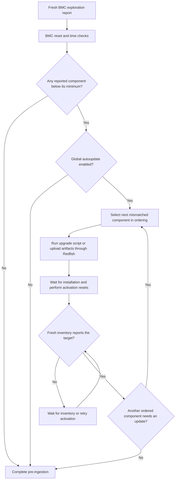

# Pre-ingestion Firmware Updates

Pre-ingestion firmware updates run against a discovered host BMC before NICo
creates the managed host. Their purpose is to update firmware that is too old
for the normal ingestion and management workflow.

This path is driven by the pre-ingestion manager. It does not use Machine
Update Manager, host update windows, `explicit_start_needed`, or per-host
automatic-update overrides. A machine ID might not exist yet, so the only
automatic-update switch used by this path is `firmware_global.autoupdate`.

This page covers host firmware selected from the
[host firmware catalog](configuration.md#host-firmware-catalog). DPU BFB
recovery also runs in the pre-ingestion state machine, but installs a DPU boot
image to recover the DPU; it is not a host firmware-catalog workflow.

## Rack compute trays

An expected compute tray with a rack ID uses its rack profile instead of the
host firmware catalog. When the profile has a `firmware_object`, NICo fetches
that source-of-truth (SOT) document, reads the artifact token from the optional
named credential, and calls the RMS compute firmware API with the BMC MAC as
the node ID. The `firmware_global.autoupdate` setting does not gate this
rack-profile workflow. NICo enforces a fixed 16 MiB maximum for the fetched SOT.
Rack compute trays without a configured firmware object skip automatic firmware
updates and continue ingestion. They never use the standalone host firmware
catalog.

This path is enabled only when the Component Manager compute-tray backend is
`rms`. With another backend, compute trays keep the standard pre-ingestion
behavior. The rack state machine can still use the profile's firmware object.

NICo does not inspect or compare component versions in the SOT. RMS compares
the SOT with its firmware inventory. A successful RMS response without a job
lets NICo continue ingestion. When RMS creates a job, NICo persists the
exact job ID in pre-ingestion state and waits for completion before continuing
ingestion. Expected switches do not use this compute-tray path. Their existing
rack state-machine firmware behavior is unchanged.

## When this path applies

A host firmware update starts during pre-ingestion when all of the following
are true:

1. Site exploration has produced a BMC vendor, host model, and firmware
   inventory for an endpoint that has not completed pre-ingestion.
1. The effective host firmware catalog contains a definition for that vendor
   and model.
1. At least one reported component has
   `preingest_upgrade_when_below` configured and its reported version is lower
   than that threshold.
1. `firmware_global.autoupdate` is enabled.

The reported version must come from an inventory entry matched by
`current_version_reported_as`. A missing catalog definition, missing inventory
match, or missing version cannot trigger the update. If no other component
triggers it, NICo completes the firmware portion of pre-ingestion and continues
with ingestion.

When `firmware_global.autoupdate` is disabled, NICo still checks for versions
below the threshold, but it does not install firmware or block ingestion. It
marks pre-ingestion complete. The host model and machine ID allowlists used by
managed-host updates are not consulted here.

## Trigger and target

`preingest_upgrade_when_below` decides whether firmware work starts; it does not
specify the version NICo installs. NICo selects an installable entry from
`known_firmware` that is marked `preingestion_exclusive_config` or `default`.
A pre-ingestion-only entry allows the ingestion target to differ from the
steady-state default.

Once any component is below its threshold, NICo walks the model's `ordering`
and updates every ordered component whose reported version differs from its
pre-ingestion target. A component does not need to be below its own threshold
at this point. If no ordering is configured, the legacy default is BMC followed
by UEFI.

For example:

| Component | Minimum | Target | Reported on host A | Reported on host B |
|---|---|---|---|---|
| BMC | `7.00` | `7.10` | `6.50` | `7.05` |
| UEFI | `1.50` | `1.80` | `1.60` | `1.60` |

- Host A triggers pre-ingestion firmware work because its BMC is below `7.00`.
  NICo updates both BMC and UEFI because both differ from their targets.
- Host B does not trigger pre-ingestion firmware work because both components
  meet their minimums. After ingestion, both can still be treated as drifted
  from their steady-state targets.

## Update sequence



The state machine performs the following work:

1. **Prepare the BMC.** NICo attempts an initial BMC reset, waits for a fresh
   exploration report, configures the site's NTP servers, and checks BMC time.
   Firmware comparison uses the refreshed inventory.
1. **Evaluate minimums.** NICo selects the effective catalog definition by BMC
   vendor and host model, then compares matched inventory versions with each
   configured pre-ingestion threshold.
1. **Select one component.** If a minimum is breached, NICo follows `ordering`
   and selects the first component whose reported version differs from its
   pre-ingestion target. Components are handled serially for each endpoint.
1. **Install the firmware.** A firmware entry with `script` runs the configured
   local upgrade script. Otherwise NICo resolves the artifact, waits for a
   shared upload slot, and uploads it through Redfish. Multi-artifact entries
   are installed in sequence.
1. **Activate and verify.** NICo waits for the Redfish task, performs the
   component-specific reset, reboot, or configured power drains, and requests
   a fresh exploration report. When the matching inventory entry is present,
   NICo waits until its reported version matches the target. A missing entry
   cannot be verified or selected for another update.
1. **Continue ingestion.** NICo repeats target selection for the remaining
   ordered components. When none need an update, it marks pre-ingestion
   complete and the normal ingestion process can continue.

`firmware_global.max_uploads` limits concurrent uploads across firmware
workflows. `firmware_global.concurrency_limit` limits how many endpoints the
pre-ingestion manager processes concurrently; it does not allow parallel
component updates on one endpoint.

## Monitor progress

Use the BMC address to inspect the latest exploration report and pre-ingestion
state:

```bash
nico-admin-cli -a <core-api-url> site-explorer get-report endpoint <bmc-ip>
```

The states most relevant to host firmware are:

| State | Meaning |
|---|---|
| `InitialBMCReset`, `SetNtpServers`, `TimeSyncReset` | NICo is preparing the BMC and obtaining reliable inventory before comparing versions. |
| `UpgradeFirmwareWait` | The firmware was uploaded and NICo is polling the Redfish task. |
| `ScriptRunning` | The configured firmware upgrade script is running. |
| `ResetForNewFirmware` | Installation completed and NICo is performing activation resets or power drains. |
| `NewFirmwareReportedWait` | NICo is waiting for refreshed inventory to report the target version. |
| `RecheckVersions`, `RecheckVersionsAfterFailure` | NICo is checking the current component again or selecting the next one. |
| `RackFirmwareUpdateWait` | Rack compute firmware submission or its exact RMS job is pending. |
| `Complete` | No applicable pre-ingestion update remains, or firmware autoupdate was disabled. Ingestion can continue. |
| `Failed` | Pre-ingestion stopped and requires operator action. The state includes the reason. |

`Complete` does not mean every component matches its steady-state default. It
means no pre-ingestion update remains after applying the rules above.

The following metrics provide site-wide visibility:

| Metric | What it shows |
|---|---|
| `carbide_preingestion_total` | Endpoints currently being evaluated by the full pre-ingestion state machine. |
| `carbide_preingestion_waiting_download` | Endpoints whose firmware work was deferred because no upload slot was available. |
| `carbide_preingestion_waiting_installation` | Endpoints waiting for a Redfish firmware task to complete. |
| `carbide_preingestion_firmware_upload_total` | Upload attempts by method and outcome. |
| `carbide_preingestion_firmware_upgrade_tasks_total` | Completed and failed Redfish tasks by component and final task state. |
| `carbide_preingestion_power_control_total` | Host, BMC, and chassis power operations by operation and outcome. |

## Failures and retries

NICo retries most transient conditions on later pre-ingestion passes. These
include an unavailable BMC, a busy upload limit, artifact download still in
progress, Redfish upload errors, and inventory that has not yet refreshed. A
failed Redfish task causes NICo to refresh inventory and evaluate the component
again. If an installed version is still not reported after 30 minutes, NICo can
repeat the activation reset unless `firmware_global.no_reset_retries` is set.

Rack compute pre-ingestion retries unavailable SOT downloads, BMC credentials,
artifact-token credentials, RMS status reads, and submission failures that occur
before RMS receives the request. If NICo restarts after submitting an update but
before it persists the RMS job ID, NICo marks the tray `Failed` instead of
risking a duplicate update. Reconcile the RMS job before clearing the error and
retrying pre-ingestion. NICo also marks the tray `Failed` if RMS no longer
recognizes a persisted job ID. A failed RMS submission is also terminal; when
the response includes a job ID, reconcile that job before retrying.

Some failures, including an unsuccessful upgrade script or exhausted BMC time
synchronization attempts, move the endpoint to `Failed`. Correct the underlying
problem, then clear the error to restart pre-ingestion from `Initial`:

```bash
nico-admin-cli -a <core-api-url> site-explorer clear-error <bmc-ip>
```

The command resets only a terminal `Failed` pre-ingestion state; it does not
interrupt an update that is still progressing.

An upgrade script interrupted by a NICo restart is not resumed automatically
and can remain in `ScriptRunning`. After confirming that the script and firmware
operation are no longer running, an operator can delete the unpaired explored
endpoint as a last resort and allow it to be discovered again:

```bash
nico-admin-cli -a <core-api-url> site-explorer delete --address <bmc-ip>
```

NICo rejects explored-endpoint deletion after the endpoint belongs to a managed
host.
