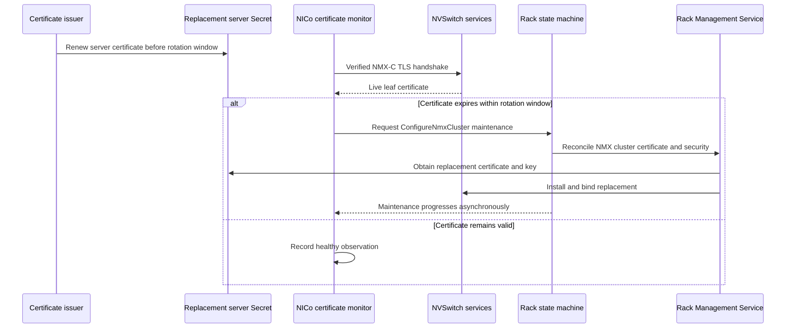

# NMX-C Certificate Monitoring and Rotation

NICo can monitor the TLS certificate presented by each discovered NMX-C
certificate-monitor target and request certificate reconfiguration before
that certificate expires.

Automatic expiry-triggered rotation requires Rack Management Service (RMS)
and a rack and switches ingested into NICo. The rack must be `Ready`, and NICo
must be able to discover a ready Fabric Manager control-plane switch for it.
Other NMX-C endpoints can still be monitored for alerting, but you
must rotate those certificates manually.

For a successful handshake, the monitor evaluates the NMX-C server leaf. The
public key infrastructure (PKI) controller renews the NICo client certificate
and the replacement server Secret independently. Changing the switch trust
anchor is a separate, coordinated operation. The monitor also cannot identify
or target an expired intermediate; recovery requires the server-certificate
installation path to replace the chain served by NMX-C.

Related guidance:

- [NVLink Partitioning](../manuals/nvlink_partitioning.md)
- [Switch Certificate Configuration](../architecture/state_machines/switch_configure_certificate.md)
- [Rack State Machine](../architecture/state_machines/rackstatemachine.md)
- [RMS Configuration](../configuration/rms.md)

## How Rotation Works

The certificate monitor runs once when `nico-api` starts and then at the
configured interval:

1. NICo resolves one NMX-C endpoint for each eligible rack. NICo prefers a
   ready primary control-plane switch.
2. NICo opens a verified TLS connection, using the configured CA bundle and,
   when NMX-C requires mTLS, the configured NICo client certificate and key.
3. NICo reads the first certificate presented by NMX-C and records its SHA-256
   fingerprint and `notAfter` time.
4. If `notAfter` is less than or equal to the current time plus
   `rotate_before_expiry`, NICo requests full-rack maintenance scoped to
   `ConfigureNmxCluster`.
5. The rack state machine runs the RMS-backed NMX cluster workflow. RMS
   selects the primary switch and ensures its NMX-C security as part of the
   NMX cluster job. RMS obtains the already-issued replacement and installs
   and binds it on the switch. NICo does not include certificate bytes or a
   Secret reference in the request.
6. A later monitor pass verifies the certificate that NMX-C now presents.



<Note>
The monitor requests the complete `ConfigureNmxCluster` rack-maintenance
activity, not only a certificate copy. This activity also reconciles the
scale-up Fabric Manager. Schedule the certificate lifetime and rotation window
with that operational impact in mind.
</Note>

The monitor also treats an expired-certificate validation error as a rotation
signal, but it does not prove that the server leaf expired. rustls can return
`ExpiredContext` for the leaf or for a server-provided intermediate. The
error does not identify which certificate expired or include its fingerprint,
and the monitor reduces either case to an expired-handshake outcome without
retaining the error's `notAfter` time. It therefore requests
`ConfigureNmxCluster` in either case.

Installing a renewed server leaf can recover an expired-leaf failure. If a
server-provided intermediate expired, a leaf-only replacement does not recover
TLS unless the installation also replaces the served chain. Inspect the chain
configured on NMX-C and install and bind a complete chain containing a valid
intermediate before retrying. Other connection or TLS failures, such as an
unknown CA, a hostname mismatch, a rejected client certificate, or a timeout,
do not trigger rotation because they do not show that certificate expiry is
the cause.

## Certificate and Trust Requirements

Use one site-scoped switch issuer for the NICo client and switch server
certificates, and for the RMS client certificate when the deployment permits
it. The peers then use the same trust anchor, while the private keys remain
with their respective owners.

The following table summarizes which certificates each client and server
validates:

| Connection | The Client Validates | The Server Validates |
| ---------- | -------------------- | -------------------- |
| NICo to NMX-C | NMX-C server leaf, its chain, and the SAN selected by `nmx_c_tls_authority` | When NMX-C mTLS is enabled, the NICo client leaf and its allowed identity |
| RMS to NVUE | NVUE server leaf, its chain, and the SAN matching the NVUE address used by RMS | When NVUE mTLS is enabled, the RMS client leaf and its allowed identity |

The same site CA can establish all four trust relationships. Each client still
needs the correct CA bundle, and each server needs the correct client trust
anchor.

### Switch Trust Anchor

- **Properties:** Root CA certificate, plus any intermediates needed to
  validate client leaves. Never distribute the CA private key.
- **Used by:** Install it in the NMX-C client-trust configuration. Install it
  in NVUE as well when RMS uses NVUE mTLS.

### NICo NMX-C Client Certificate

- **Properties:** Signed by the switch issuer, with `digitalSignature` and
  `clientAuth` usages and a URI SAN allowed by the issuer and NMX-C identity
  policy. A DNS SAN is not required for a client identity.
- **Stored in:** The NICo namespace. Mount the certificate, private key, and CA
  certificate read-only into `nico-api`.

### NMX-C Server Certificate

- **Properties:** Signed by the switch issuer, with `digitalSignature` and
  `serverAuth` usages and a DNS or IP SAN matching `nmx_c_tls_authority`, or
  the endpoint host when no authority override is set. NVOS also requires the
  `clientAuth` usage when this certificate is bound as the NMX-C entity
  certificate. If NVUE and NMX-C share this leaf, its SANs must also cover the
  NVUE address used by RMS.
- **Stored in:** The RMS namespace when RMS performs automatic installation,
  so RMS can read the Secret without copying private-key material between
  namespaces. Install and bind the certificate and private key on NMX-C.

### RMS Client Certificate

- **Properties:** Signed by a CA trusted by NVUE, with `digitalSignature` and
  `clientAuth` usages and an identity allowed by the switch policy. This is
  required when RMS connects to NVUE with mTLS.
- **Stored in:** The RMS namespace. NICo does not need this private key. RMS
  also needs a CA bundle that validates the NVUE server leaf.

The switch must receive a complete trust chain in the format required by its
software. In particular, do not assume that an intermediate-only CA bundle is
accepted by every NVUE or NMX-C release. Install the root trust anchor and any
required intermediates according to the switch platform documentation.

The issuer must also:

- populate a CA certificate that NICo can mount as a PEM file;
- accept the requested SANs, key algorithm, duration, and extended key usages;
- be allowed by any cert-manager approver policy installed in the cluster; and
- issue the replacement server certificate before NICo enters its rotation
  window.

## Dependencies

Certificate monitoring requires:

- an HTTPS NMX-C endpoint;
- a PEM CA bundle configured through `nmx_c_tls_ca_cert_path`;
- a server SAN that matches the configured TLS authority;
- a matching client certificate and key when NMX-C requires mTLS; and
- an endpoint discoverable from switch inventory or an explicit chassis
  mapping.

The monitor creates an empty TLS root store and loads only
`nmx_c_tls_ca_cert_path`. It does not fall back to the container's system trust
store, and `allow_insecure` does not disable verification for certificate
probes.

For rack-derived endpoints, `allow_insecure = true` without a configured
client certificate and key produces an `http://` NMX-C URL. The certificate
monitor rejects that endpoint because plaintext connections cannot present a
TLS certificate.

Automatic rotation additionally requires:

- RMS deployed and reachable from NICo, with the `[rms]` client configured;
- `nv_switch_backend = "rms"` under `[component_manager]`;
- an ingested rack in the `Ready` state and ingested switches associated with
  that rack;
- at least one non-deleted, ready switch with Fabric Manager status `Ok`, its
  control plane configured, and an NVOS address that NICo can use for endpoint
  discovery;
- usable NVOS and BMC endpoint data and credentials for the rack switches, and
  a known rack profile. The RMS V2 workflow requires complete endpoint
  inventory for every switch and `rack_hardware_topology` in the profile;
- RMS configured with a source for the current replacement server certificate
  and private key, and able to install and bind them on the switch; and
- a CA bundle that RMS can use to validate the NVUE server certificate, a
  server SAN matching the NVUE address RMS uses, and an RMS client certificate
  that NVUE trusts when NVUE requires mTLS.

NICo does not pass certificate bytes or Kubernetes Secret references to RMS.

If different rack maintenance is already pending, or the rack is not ready,
NICo defers rotation and tries again on a later monitor pass. An identical
`ConfigureNmxCluster` request that is already pending is not duplicated.

## Provision the Certificates

A cert-manager `Certificate` declares the certificate to issue and the Secret
in which to store it. cert-manager creates a `CertificateRequest` for the
configured `issuerRef`, then stores the issued leaf and private key as
`tls.crt` and `tls.key` in that Secret. Workloads consume the Secret rather
than the `Certificate` resource. cert-manager renews the certificate according
to `renewBefore`; issuers that support it also populate `ca.crt`. A
`Certificate` does not by itself guarantee that the resulting Secret contains
`ca.crt`.

A `ClusterIssuer` is the Kubernetes object that tells cert-manager how to
reach a signer. It is not itself the CA certificate that peers trust. The
signer behind it owns the CA key and produces certificates that chain to the
site trust anchor.

### Check the Issuer

The examples below use `vault-nico-issuer`. Confirm that cert-manager and the
issuer are ready before creating certificate requests:

```bash
kubectl get crd certificates.cert-manager.io
kubectl get clusterissuer vault-nico-issuer
kubectl describe clusterissuer vault-nico-issuer
```

Use the actual issuer name for the deployment. If it is a namespaced `Issuer`
rather than a `ClusterIssuer`, it must exist in each namespace where a
`Certificate` is created.

### Choose Secret Ownership

Keep each private-key Secret in the namespace of the workload that consumes
it:

- Create the NICo client certificate in the NICo namespace and mount it
  read-only into `nico-api`.
- If RMS performs automatic installation, create the server certificate in
  the RMS namespace. Its deployment must also provision the RMS client
  identity and trust bundle needed for NVUE mTLS. This avoids copying
  private-key Secrets between namespaces.
- The NICo chart's optional `nvSwitchTls.switchServer` profile always creates
  the server Secret in the NICo release namespace. Use that profile only when
  the NICo release or you own the artifact. For RMS-backed automatic
  rotation, the RMS chart or deployment manifests should create the
  `Certificate` in the RMS namespace instead.
- Without RMS, you can own the server Secret in an appropriate restricted
  namespace and install each renewal manually. Monitoring and alerting still
  work, but automatic rotation does not.

### Create the Certificate Requests

The following cert-manager resources illustrate the required profiles. Change
the namespaces, identities, issuer, and server SAN to match the deployment.
The 30-day lifetime and ECDSA P-256 key profile are examples; issuer, approver,
and switch-platform constraints determine the values a site can use.

```yaml
apiVersion: cert-manager.io/v1
kind: Certificate
metadata:
  name: nvswitch-nico-client-certificate
  namespace: <nico-namespace>
spec:
  secretName: nvswitch-nico-client-certificate
  duration: 720h0m0s
  renewBefore: 360h0m0s
  usages:
    - digital signature
    - client auth
  uris:
    - spiffe://<trust-domain>/<nico-namespace>/sa/nico-nmxc
  privateKey:
    algorithm: ECDSA
    size: 256
    rotationPolicy: Always
  issuerRef:
    kind: ClusterIssuer
    name: vault-nico-issuer
    group: cert-manager.io
---
apiVersion: cert-manager.io/v1
kind: Certificate
metadata:
  name: nvswitch-server-certificate
  namespace: <server-secret-namespace>
spec:
  secretName: nvswitch-server-certificate
  duration: 720h0m0s
  renewBefore: 360h0m0s
  usages:
    - digital signature
    - server auth
    - client auth
  dnsNames:
    - nmxc.example.internal
  privateKey:
    algorithm: ECDSA
    size: 256
    rotationPolicy: Always
  issuerRef:
    kind: ClusterIssuer
    name: vault-nico-issuer
    group: cert-manager.io
```

### Use the NICo Helm Chart

The `nico-api` Helm chart can create the NICo client certificate, mount its
Secret read-only, and optionally create an operator-owned server Secret. Both
certificate profiles and the monitor are disabled by default and are enabled
independently.

Merge the following values into your existing values file. Do not
replace unrelated site configuration:

```yaml
nico-api:
  nvSwitchTls:
    issuerRef:
      kind: ClusterIssuer
      name: vault-nico-issuer
      group: cert-manager.io
    nicoClient:
      enabled: true
      uris:
        - spiffe://<trust-domain>/<nico-namespace>/sa/nico-nmxc
      privateKey:
        algorithm: ECDSA
        size: 256
        rotationPolicy: Always

    # Enable only when this NICo release or an operator owns the server Secret.
    switchServer:
      enabled: true
      dnsNames:
        - nmxc.example.internal
      privateKey:
        algorithm: ECDSA
        size: 256
        rotationPolicy: Always

  siteConfig:
    enabled: true
    nicoApiSiteConfig: |
      [nvlink_config]
      enabled = true
      nmx_c_tls_ca_cert_path = "/var/run/secrets/nico-roots/ca.crt"
      nmx_c_tls_client_cert_path = "/var/run/secrets/nvswitch-client/tls.crt"
      nmx_c_tls_client_key_path = "/var/run/secrets/nvswitch-client/tls.key"
      nmx_c_tls_authority = "nmxc.example.internal"
      nmx_c_endpoint_port = 9370
      allow_insecure = false

      [nvlink_config.nmx_c_certificate_rotation]
      enabled = true
      run_interval = "1h"
      rotate_before_expiry = "1w"
      probe_timeout = "10s"
```

The standard chart mounts `Secret/nico-roots` read-only at
`/var/run/secrets/nico-roots`. In a standard `helm-prereqs` deployment, External
Secrets manages its `data.ca.crt` from the site root used by
`vault-nico-issuer`, so the example uses that independently managed trust
bundle. Verify that the key exists and contains the expected trust anchor as
described in [Verify the Setup](#verify-the-setup) before starting the monitor.

Enabling `nicoClient` mounts the cert-manager-issued client Secret, but Helm
does not create a `ca.crt` key in it; an issuer can add that key, but it is not
guaranteed. If the switch uses a different CA from `nico-roots`, provision and
mount that server trust bundle separately and set `nmx_c_tls_ca_cert_path` to
its file instead. The current `nvSwitchTls` values do not add a custom CA
volume; provide that mount through the surrounding deployment mechanism.

Enabling `nicoClient` creates and mounts the client Secret, but does not set
the TOML paths or start the certificate monitor. The `siteConfig` settings do
that separately. If RMS owns the server private key, leave
`switchServer.enabled = false` and create that certificate through the RMS
deployment instead.

### Mount the Secret Without the NICo Helm Integration

For another deployment mechanism, mount the client Secret and the NMX-C server
trust bundle at stable read-only paths in `nico-api`; the configuration example
below uses `/var/run/secrets/nvswitch-client` and
`/var/run/secrets/nvswitch-ca`:

```yaml
spec:
  template:
    spec:
      containers:
        - name: nico-api
          volumeMounts:
            - name: nvswitch-nico-client
              mountPath: /var/run/secrets/nvswitch-client
              readOnly: true
            - name: nvswitch-ca
              mountPath: /var/run/secrets/nvswitch-ca
              readOnly: true
      volumes:
        - name: nvswitch-nico-client
          secret:
            secretName: nvswitch-nico-client-certificate
        - name: nvswitch-ca
          secret:
            secretName: nvswitch-server-ca
            items:
              - key: ca.crt
                path: ca.crt
```

Configure RMS with the server-certificate Secret, RMS client identity, and
NVUE trust bundle separately.

An approver policy must allow the selected issuer, identities, duration, key
profile, and usages. If issuance stalls, inspect the `CertificateRequest`
conditions and events:

```bash
kubectl get certificaterequest -n <certificate-namespace>
kubectl describe certificaterequest -n <certificate-namespace> <request-name>
```

<Warning>
Creating or renewing the switch server Secret does not install it on a
physical switch. Bootstrap every switch with the server certificate and key,
install the switch trust anchor, and bind the certificate to NMX-C before
enabling the monitor.
</Warning>

## Configure NICo

Configure the NMX-C TLS client and enable certificate rotation in the
`nico-api` site configuration:

`nmx_c_tls_ca_cert_path` must name an existing, non-empty PEM CA bundle that
validates the NMX-C server chain. The example below uses the standard chart's
independently managed `nico-roots` mount. For another deployment or switch CA,
point this setting at its separately managed CA mount, such as
`/var/run/secrets/nvswitch-ca/ca.crt` in the manual example above. Do not assume
that the client certificate Secret contains `ca.crt`.

```toml
[nvlink_config]
enabled = true
nmx_c_tls_ca_cert_path = "/var/run/secrets/nico-roots/ca.crt"
nmx_c_tls_client_cert_path = "/var/run/secrets/nvswitch-client/tls.crt"
nmx_c_tls_client_key_path = "/var/run/secrets/nvswitch-client/tls.key"
nmx_c_tls_authority = "nmxc.example.internal"
nmx_c_endpoint_port = 9370
allow_insecure = false

[nvlink_config.nmx_c_certificate_rotation]
enabled = true
run_interval = "1h"
rotate_before_expiry = "1w"
probe_timeout = "10s"
```

When using the NICo Helm chart, merge this TOML into the existing
`nico-api.siteConfig.nicoApiSiteConfig` value. Do not replace unrelated site
configuration that the deployment already requires.

The following table describes the certificate rotation settings:

| Rotation Setting | Default | Meaning |
| ---------------- | ------- | ------- |
| `enabled` | `false` | Starts the certificate monitor. This setting is independent of the NVLink partition monitor's `nvlink_config.enabled` gate. |
| `run_interval` | `1h` | Target interval between pass starts. The first pass runs at startup; if a pass exceeds the interval, the next pass starts immediately. |
| `rotate_before_expiry` | `1w` | Inclusive window before `notAfter` in which rotation is requested. Duration strings such as `2w` are supported. |
| `probe_timeout` | `10s` | Separate timeout applied to TCP connection and TLS handshake operations for each endpoint. |

`expiry_warning_window` is accepted as a legacy alias for
`rotate_before_expiry`.

<Note>
Set `nvlink_config.enabled` according to whether the site uses automated NVLink
partition reconciliation. The certificate monitor needs only its nested
`enabled` setting, so an alert-only deployment can leave
`nvlink_config.enabled = false`.
</Note>

Set the server certificate's renewal time comfortably earlier than the NICo
rotation window. For example, a 30-day server certificate can use
`renewBefore: 360h` (15 days) while NICo uses
`rotate_before_expiry = "1w"`. This gives the issuer time to place a new
certificate in the Secret before NICo asks RMS to install it.

`nico-api` picks up renewed mounted TLS material without a restart. The
NMX-C client pool rebuilds a cached channel when it detects newer CA, client
certificate, or client key files, and the certificate monitor uses the
current mounted material on subsequent probes. Changes to the TOML settings
themselves require a `nico-api` restart or rollout.

RMS owns NMX-C security reconciliation as part of the NMX cluster job.
Configure certificate sources, trust, and service bindings in RMS. The
[Switch Certificate Configuration](../architecture/state_machines/switch_configure_certificate.md)
guide describes the backend-specific workflow.

## Configure Endpoint Discovery

For automatic rotation, NICo selects one ready Fabric Manager control-plane
switch per rack and prefers the switch marked as primary. NICo derives the
endpoint from its NVOS IP and `nmx_c_endpoint_port`. Endpoint discovery alone
is not sufficient for rotation: RMS and the rack data listed in
[Dependencies](#dependencies) must also be available.

If your site does not have an actionable RMS-backed rack, you can register an
explicit endpoint for each ingested MNNVL chassis serial.

The following commands use `-a` to select the Core API. The
[Connecting to nico-api](../manuals/nico-admin-cli.md#connecting-to-nico-api)
guide describes authentication and connection configuration.

```bash
nico-admin-cli -a <core-api-url> nvlink-nmxc-endpoints create \
    --chassis-serial <serial> \
    --endpoint https://nmxc.example.internal:9370

nico-admin-cli -a <core-api-url> nvlink-nmxc-endpoints show
```

Explicit chassis mappings are alert-only because they do not identify an
actionable rack. NICo probes them and emits expiry metrics and logs, but it
does not request automatic rotation.

## Verify the Setup

1. Confirm that cert-manager issued the resources and that the Secrets exist
   in their owning namespaces. Repeat the certificate check for each owner
   namespace when they differ:

   ```bash
   kubectl get certificate,certificaterequest -n <nico-namespace>
   kubectl get certificate,certificaterequest -n <server-secret-namespace>
   kubectl get secret nico-roots -n <nico-namespace>
   kubectl get secret nvswitch-nico-client-certificate -n <nico-namespace>
   kubectl get secret nvswitch-server-certificate -n <server-secret-namespace>
   ```

2. Inspect the public portions without printing private-key data:

   ```bash
   kubectl get secret nico-roots \
       -n <nico-namespace> \
       -o jsonpath='{.data.ca\.crt}' \
     | base64 --decode \
     | openssl x509 -noout -subject -issuer -dates

   kubectl get secret nvswitch-nico-client-certificate \
       -n <nico-namespace> \
       -o jsonpath='{.data.tls\.crt}' \
     | base64 --decode \
     | openssl x509 -noout -subject -issuer -dates \
         -ext extendedKeyUsage,subjectAltName

   kubectl get secret nvswitch-server-certificate \
       -n <server-secret-namespace> \
       -o jsonpath='{.data.tls\.crt}' \
     | base64 --decode \
     | openssl x509 -noout -subject -issuer -dates \
         -ext extendedKeyUsage,subjectAltName
   ```

   The first OpenSSL command must parse at least one CA certificate. An empty
   `data.ca.crt`, a missing key, or invalid PEM causes it to fail. When using a
   separate CA Secret, run the same check against that Secret and key instead.

3. Install and bind the server certificate, switch trust anchor, and required
   intermediates on the switch using the switch platform's supported
   procedure. Confirm that NMX-C presents the expected server leaf and accepts
   the NICo client identity.
4. Roll out the NICo configuration. The monitor runs its first pass
   immediately.
5. Check the logs for `Observed NMX-C server certificate` at debug level, or
   `NMX-C server certificate is due for rotation` at warning level. Both
   successful-probe records include the endpoint, observed fingerprint, and
   expiry epoch; the due-for-rotation warning also includes the configured
   window. The separate
   `NMX-C server certificate is expired` warning comes from a failed chain
   validation and contains no fingerprint or expiry timestamp; despite the log
   wording, it does not distinguish an expired leaf from an expired
   intermediate.

## Monitor Rotation

The latency histogram accumulates one observation for each monitor iteration
attempt, including attempts that return before probing, such as when a replica
does not acquire the shared work lock. The observable gauges describe
endpoint outcomes from the most recently retained iteration; they are not
cumulative counters. An iteration that does not probe an endpoint emits no
endpoint-status samples.

In a multi-replica deployment, every `nico-api` replica starts the monitor
loop, but a shared work lock allows only one replica to probe during a pass.
Inspect metrics and logs across all replicas; a replica that did not acquire
the lock can record a latency sample without endpoint-status samples. No metric
independently proves that the complete target set was probed; endpoint-status
gauges and per-endpoint logs only confirm that endpoint processing occurred.

The following table describes the certificate monitor metrics:

| Metric | Type | Meaning |
| ------ | ---- | ------- |
| `carbide_nvlink_switch_cert_monitor_iteration_latency_milliseconds` | Histogram | Duration of a monitor iteration attempt. A sample proves that the loop ran, but does not by itself prove that endpoint probes completed; use endpoint-status gauges and monitor logs to confirm endpoint processing. |
| `carbide_nvlink_switch_cert_monitor_observed_cert_expiration_time` | Gauge | Earliest observed leaf expiry as epoch seconds, grouped by `status=ok\|expiring_soon`. An expired-certificate handshake has no timestamp sample because the monitor discards the error's certificate metadata; NICo cannot tell whether the leaf or a server-provided intermediate expired. |
| `carbide_nvlink_switch_cert_monitor_probe_success` | Gauge | Endpoint count grouped by `status=ok\|error`. |
| `carbide_nvlink_switch_cert_monitor_expiring_soon` | Gauge | Endpoint count grouped by `status=ok\|expiring_soon\|unknown`. |
| `carbide_nvlink_switch_cert_monitor_apply_status` | Gauge | Endpoint count grouped by `status=not_needed\|pending\|error\|skipped`. `pending` means maintenance was queued or already queued, not that installation has completed. |
| `carbide_nvlink_switch_cert_monitor_probe_error_count` | Gauge | Probe failures grouped by `status="error"` and `error_kind`, such as `timeout`, `connection`, `tls`, or `certificate_file`. |
| `carbide_nvlink_switch_cert_monitor_apply_error_count` | Gauge | Rotation-request failures grouped by `status="error"` and `error_kind`. |

You must create alert rules; NICo does not install them automatically. At
minimum, alert when an endpoint is within the rotation window or cannot be
probed:

```promql
carbide_nvlink_switch_cert_monitor_expiring_soon{status="expiring_soon"} > 0

carbide_nvlink_switch_cert_monitor_probe_success{status="error"} > 0
```

If you use RMS-backed automatic rotation, also alert on immediate scheduling
errors:

```promql
carbide_nvlink_switch_cert_monitor_apply_status{status="error"} > 0
```

Do not alert on every `status="skipped"` sample without additional context.
That status is expected for alert-only chassis mappings and can be transient
while a rack is busy or not ready.

After maintenance completes, confirm that a later pass observes a new
fingerprint and an expiry outside the rotation window. If the switch continues
to present the old certificate, NICo requests maintenance again on later
passes; the monitor does not maintain a separate desired fingerprint or
cooldown.

## Troubleshoot Rotation

Use the following table to troubleshoot certificate rotation:

| Symptom | Likely Cause or Action |
| ------- | ---------------------- |
| No iteration-latency samples on any replica | Confirm `nmx_c_certificate_rotation.enabled = true` and roll out or restart `nico-api`. |
| Latency samples exist but no endpoint-status series | Verify that NICo can discover a target. In a multi-replica deployment, also check the replica that acquired the shared work lock. |
| `nmx_c_tls_ca_cert_path is required` | Mount a PEM CA bundle and configure its path. The monitor does not use system roots. |
| Probe reports a TLS error and no rotation is requested | Correct the CA bundle, authority/SAN, client certificate, key, or validity problem. Only rustls's explicit expired-certificate validation error for the server chain is treated as a rotation signal. |
| Expiring certificate has apply status `skipped` | A legacy chassis mapping is alert-only, the rack is not ready, or different rack maintenance is pending. |
| Apply status is `error` | NICo could not request rack maintenance. Inspect the accompanying log for missing component-manager configuration or a database/state-controller request error. |
| Apply status remains `pending` | `pending` means only that maintenance was accepted or was already queued. Inspect the rack state, rack-controller logs, and RMS job for the eventual result. |
| Kubernetes Secret is renewed but the switch serves the old leaf | The issuer has completed only the issuance step. Verify RMS's configured certificate source and inspect the RMS certificate or NMX cluster job; NICo does not tell RMS which Secret to use. |
| Maintenance repeats every monitor pass | RMS is reinstalling the old certificate, cannot access the renewed Secret, or NMX-C is not bound to the installed replacement. Compare the served fingerprint after each job. |
| TLS validation reports an expired certificate | NICo requests maintenance, but cannot identify whether the expired certificate is the server leaf or a server-provided intermediate. Recovery still depends on working RMS-to-switch TLS paths. If NVUE shares the expired identity, manual recovery can be required. Do not rely on post-expiry rotation. |
| A renewed leaf is installed but TLS still reports expiry | Inspect every certificate in the chain served by NMX-C. Replace any expired intermediate and install and bind a complete valid chain; rotating only the leaf cannot repair an expired intermediate unless the installation also updates that chain. |
