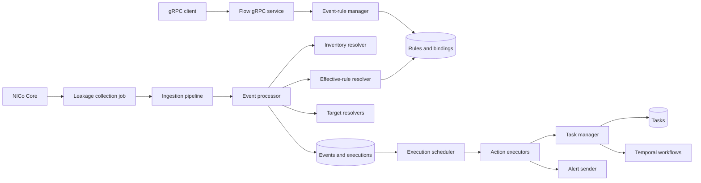
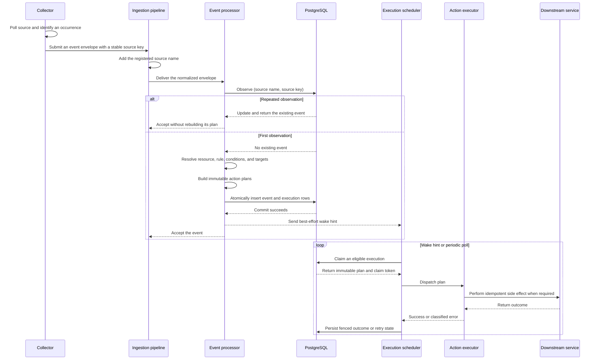
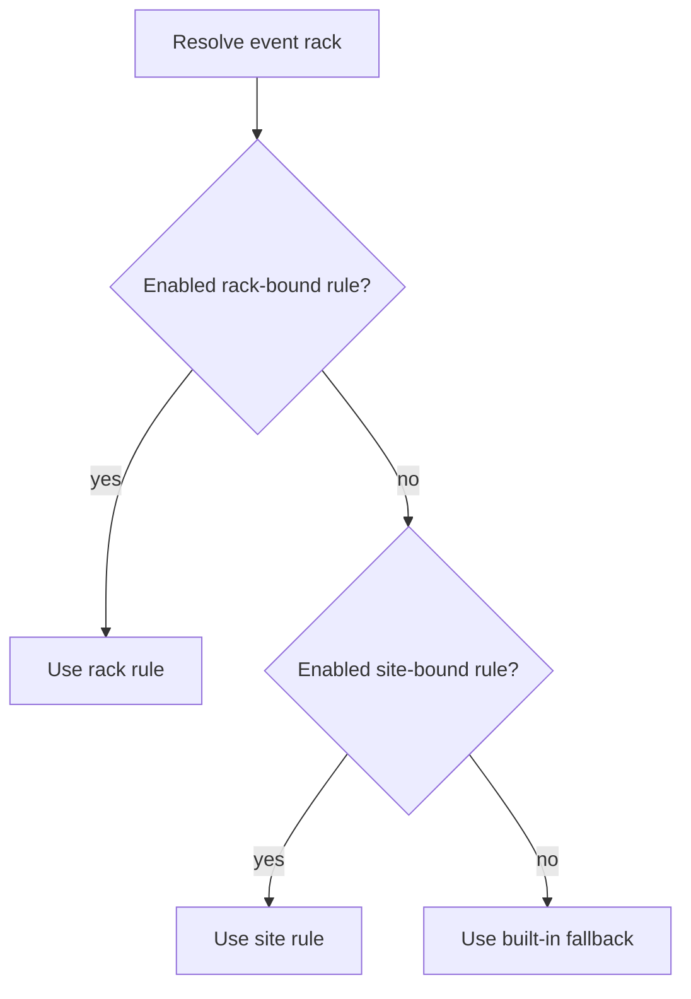
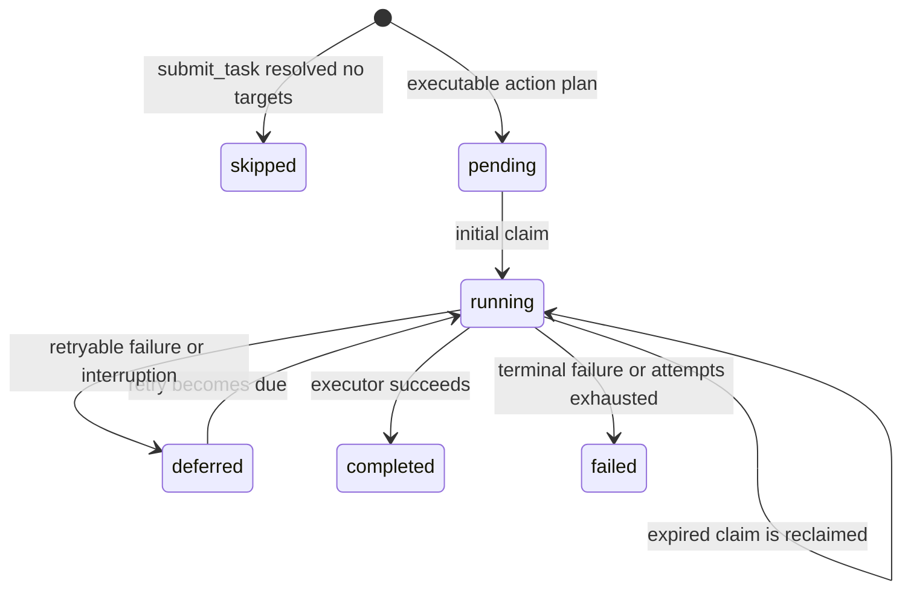

# Event-Rule Architecture

This document describes how Flow ingests events, selects event rules, creates
durable action plans, and executes them across service instances. For public
API contracts and examples, see the [Event Rules Usage Guide](event-rules-guide.md).

## Scope and invariants

Each supported event type needs to register an immutable built-in fallback
event rule. Currently, Flow supports only one event type:
`hardware.leak.detected`. Its built-in rule force-powers-off components that
the leakage target resolver considers affected.

The subsystem provides these invariants:

- Every supported event type has one enabled, immutable built-in rule.
- A concrete event resolves to at most one effective rule.
- The first accepted observation snapshots the applicable policy and targets.
- The event and all of its action executions are committed atomically.
- Repeated observations do not create or restart action executions.
- Each execution claim has a unique token, and only the worker holding the
  current token can record the result. This lets several Flow instances safely
  process the same backlog.
- All attempts for the same action use the same idempotency key, allowing the
  downstream service to recognize duplicate requests after a retry or reclaim.

The gRPC API manages rules and bindings. Events and action executions are
internal durable records; the v1 API does not expose query methods for them.

## Components

The subsystem has five main parts:

1. The **manager** validates mutations, owns built-in rules, and assembles the
   processor, target registry, executor registry, and scheduler.
2. The **ingestion pipeline** assigns a registered source name and retries
   transient delivery failures while preserving the source event key.
3. The **processor** resolves inventory, selects one effective rule, evaluates
   conditions, resolves targets, and constructs a complete event plan.
4. The **PostgreSQL store** persists rules, bindings, deduplicated events, and
   immutable action plans.
5. The **scheduler** claims pending or retryable executions and dispatches them
   through typed executors.

There is no process-local rule cache. Persisted rule and binding lookups read
PostgreSQL, so one instance can observe configuration written by another.

## End-to-end processing flow

Event processing has two phases separated by an atomic database commit. The
collector and processor synchronously turn an observation into a durable event
plan. After that commit, the scheduler asynchronously executes the persisted
action executions. The scheduler claims execution rows; it does not process the
original envelope or claim the event row.

The flow is:

1. **Collect an observation.** A collector reads an event source and creates an
   envelope containing the event type, severity, observed resource, observation
   time, and a source key that remains stable for the occurrence. The leakage
   collector creates one envelope for each leaking component it observes.
2. **Normalize and deliver the envelope.** The registered ingestion source adds
   its stable source name. The pair `(source_name, source_key)` becomes the
   durable occurrence identity. The ingestion pipeline retries nonterminal
   processor failures without changing that identity.
3. **Deduplicate before planning.** The processor first asks the store to
   observe the occurrence identity. For an existing event, the store increments
   its observation count and updates its last-observed time. Processing then
   stops without selecting a rule again or changing the existing action plans.
4. **Prepare the first observation.** For a new occurrence, the processor
   validates and canonically resolves the resource, selects the effective rule,
   evaluates each action condition, and resolves the concrete targets for
   applicable task actions.
5. **Build and commit the plan.** The processor snapshots the selected rule and
   applicable policy into the event and builds one immutable typed execution
   plan per applicable action. It atomically inserts the event and all execution
   rows. A concurrent first-observation race is reduced to the same duplicate
   path by the unique occurrence identity.
6. **Notify the scheduler.** After a successful new-plan commit, the processor
   sends a non-blocking wake hint. The ingestion call can now return; action
   execution is not part of the collector's synchronous request. Periodic
   scheduler polling ensures that work is discovered if the hint is missed.
7. **Claim and dispatch executions.** The scheduler claims eligible execution
   rows up to available worker capacity. Each claim atomically changes the row
   to `running`, allocates an attempt, and assigns an owner, expiration, and
   fencing token. A worker selects the executor for the persisted action type
   and dispatches the immutable plan.
8. **Perform downstream work.** The task executor submits tasks to the task
   manager, the alert executor calls the alert sender, and the no-op executor
   completes without an external call. Stable idempotency keys make repeated
   dispatch safe after retries or claim recovery.
9. **Persist the outcome.** The worker uses its claim token to record
   `completed`, `deferred`, or `failed`. Deferred executions become eligible
   after their next-attempt time. If a worker disappears or cannot persist an
   outcome, its `running` claim eventually expires and the recovery lane can
   claim the execution again.

An event whose conditions match no actions is still persisted, but it has no
execution rows for the scheduler to claim. A `submit_task` action whose target
resolution produces no materialized components is persisted as `skipped` and
is also never claimed.

The atomic plan commit is the ownership boundary for failures. Before it
succeeds, delivery retries belong to the ingestion pipeline or a later
collector run. After it succeeds, dispatch and action retries belong to the
scheduler; the collector never needs to recreate the plan.

## Domain and persistence model

### Rules and bindings

A rule owns one event type and a policy containing one or more uniquely named
actions. An action has an optional condition and exactly one typed
specification: `submit_task`, `send_alert`, or `noop`.

Built-in rules are defined by code, always enabled, and immutable. Persisted
rules are created disabled so clients can finish their configuration before
making them effective.

A binding associates a persisted rule with a site or rack selection scope.
The binding stores the rule event type as part of its lookup key. A composite
foreign key ensures that the binding type matches the referenced rule. Partial
unique indexes permit only one site binding per event type and one rack binding
per event type and rack.

The store prevents one rule from mixing site and rack bindings. A rule may be
site-wide or reused by several racks, but it cannot do both.

### Events and executions

The durable event identity is `(source_name, source_key)`. An event records its
canonical resource, selected rule UUID, effective-policy snapshot, observation
count, and timestamps.

Each applicable action produces one execution keyed by `(event_id,
action_name)`. The execution stores an immutable typed plan alongside mutable
status, retry, and claim state. A submit-task plan contains fully materialized
rack and component targets, so execution does not depend on later rule,
inventory, or topology changes.

| Table | Purpose |
|---|---|
| `event_rules` | Persisted metadata, enabled state, event type, and JSON policy. |
| `event_rule_bindings` | Site and rack selection scopes for persisted rules. |
| `events` | Deduplicated occurrences with selected-rule and policy snapshots. |
| `event_action_executions` | Action plans and mutable execution, retry, and claim state. |

Task actions create ordinary rows in `task`. Their
`trigger_type = event_rule_execution` and `trigger_id` values link them to the
event-action execution without introducing a separate task subtype.

## Effective-rule resolution

For an event associated with a rack, Flow selects the first enabled rule in
this order:

1. persisted rule bound to the rack;
2. persisted rule bound to the site; and
3. immutable built-in rule for the event type.

A disabled bound rule is skipped. Public effective-rule lookup accepts a rack
UUID or component UUID. The inventory resolver verifies the target and maps a
component to its owning rack before applying the same precedence.

## Event ingestion and planning

Each producer registers one stable source name. The ingestion pipeline applies
that name to every envelope and retries nonterminal sink failures with the same
source key. Terminal validation or resolution failures return immediately.

The leakage detector registers source name `nico_core_leakage`. It retains one
source key while a component appears in consecutive successful polls. A
successful poll that omits the component ends the occurrence; a later leak gets
a new source key. A failed source query does not end an occurrence.

For the first observation, the processor:

1. validates the envelope and checks for an existing source identity;
2. resolves its rack or component against Flow inventory;
3. resolves the effective rule and evaluates action conditions;
4. resolves and materializes task targets;
5. builds immutable action plans; and
6. atomically inserts the event and one execution per applicable action.

An event is persisted when no condition matches, but it has no executions. A
submit-task execution starts as `skipped` with reason `no_targets` when target
materialization produces no components.

Repeated delivery increments the observation count and advances the
last-observed timestamp. It does not resolve the rule again, rebuild targets,
create executions, or resume completed executions. A concurrent duplicate
racing the first insert follows the same observation-only path.

Ingestion retries and action retries are separate. Ingestion retries until an
event plan is durably accepted; the execution scheduler owns later attempts.

## Target resolution

Flow implements target resolution in code. The strategy names and resolver
behavior are not configurable, and rules cannot define new strategies or
provide inventory queries. Each `submit_task` action must select one of these
hardcoded strategies:

| Strategy | Component event | Rack event |
|---|---|---|
| `COMPONENT` | Selects only the component that produced the event. | Rejected because the event does not identify one component. |
| `RACK` | Selects the component's owning rack, then materializes every component currently known in that rack. | Selects the event rack, then materializes every component currently known in that rack. |
| `AFFECTED_COMPONENTS` | Uses the resolver selected for the event type. The generic resolver selects only the event component. | Uses the resolver selected for the event type. The generic resolver selects the event rack and materializes every component currently known in it. |

For each task action, Flow chooses exactly one resolver in this order:

1. Look for a resolver registered for the action's event type and strategy.
2. If that pair has no registration, use the hardcoded generic resolver for
   the strategy.

An event-specific registration changes only that event type and strategy; all
other event types continue to use the generic resolver. Currently, the only
event-specific registration is `hardware.leak.detected` with
`AFFECTED_COMPONENTS`.

### Leakage affected components

For a component-scoped `hardware.leak.detected` event, the event-specific
`AFFECTED_COMPONENTS` resolver:

1. loads the leaking component's rack and its component inventory;
2. finds the leaking component and requires it to have a non-negative rack
   slot ID;
3. selects the leaking component and every component in the same rack whose
   slot ID is non-negative and strictly lower than the leaking component's
   slot ID; and
4. excludes every other component at the same or a higher slot ID.

For example, if a leak is reported by the component in slot 10, the resolver
selects that component and components in valid slots below 10. It does not
select other components in slot 10 or components above slot 10. Resolution
fails if the leaking component is absent from the rack inventory or has a
negative slot ID.

For a rack-scoped leakage event, the resolver selects the rack, which is then
materialized as every component currently known in that rack.

The slot comparison is an architecture-specific approximation of which
components a leak affects; it does not represent physical isolation or power
dependencies. A topology provider should replace it when Flow needs those
relationships.

## Execution scheduler

The scheduler asynchronously dispatches the immutable action plans created
during event processing. Each applicable rule action has its own durable
execution row, so actions from the same event can progress and retry
independently. The scheduler executes the persisted plan; it does not select
the rule again or resolve its targets again.

### Execution lifecycle

The durable statuses have these meanings:

| Status | Meaning |
|---|---|
| `pending` | The plan is ready for its first attempt. |
| `running` | A scheduler worker owns a claim and is dispatching the plan. |
| `deferred` | A retryable or interrupted attempt is waiting to be claimed again. Its persisted next-attempt time controls when it becomes eligible. |
| `completed` | The executor completed the dispatch contract. For a task action, this means the task manager accepted every target submission; it does not mean the task's Temporal workflow finished. |
| `failed` | The failure is not retryable, or the execution exhausted its attempt budget. |
| `skipped` | A `submit_task` plan contained no materialized targets. The scheduler never claims it. |

Claiming an execution allocates an attempt and changes its status to `running`.
The attempt count is part of the persisted execution state, not worker-local
state.

### Lanes, wake-ups, and capacity

The scheduler uses two lanes with independent worker capacity:

| Lane | Eligible work | Default workers | Default scan limit |
|---|---|---:|---:|
| `pending` | `pending` executions, ordered by creation time and execution UUID. | 1 | 1 |
| `deferred` | Due `deferred` executions and `running` executions with expired claims, ordered by eligibility time and execution UUID. | 1 | 1 |

The scheduler refills the `pending` lane before the `deferred` lane, but a busy
pending worker does not consume the deferred lane's capacity. Before querying
the store, each lane reserves its currently available worker slots and asks for
no more claims than the smaller of its scan limit and available capacity. This
prevents the scheduler from claiming work that it has no worker capacity to
dispatch.

A refill can be requested by:

- scheduler startup;
- successful persistence of a new event plan;
- completion of a worker attempt;
- discovery that a bounded store scan may have left more eligible rows; or
- the periodic poll, which runs once per minute by default.

Wake signals are best-effort and coalesce in a one-element channel. They reduce
latency, but the periodic poll is the reliability mechanism if a notification
is missed. A claim-query failure is logged for that lane; later wake-ups and
polls retry it without stopping the other lane.

### Dispatch and outcome policy

A lane worker performs one claimed execution as follows:

1. Select the executor registered for the persisted plan's action type.
2. Call the executor with the execution UUID and immutable plan.
3. Convert the result into `completed`, `deferred`, or `failed` according to
   its error classification.
4. Persist the outcome using the claim token.
5. Return the worker slot and wake the scheduler so it can claim more work.

Executor outcomes are handled as follows:

| Outcome | Durable result |
|---|---|
| Success | `completed`. |
| Retryable error with attempts remaining | `deferred` with an absolute next-attempt time calculated from the database clock. |
| Retryable error on the final allowed attempt | `failed`. |
| Context cancellation or deadline | `deferred` with reason `attempt_interrupted`; the allocated attempt is refunded. |
| Terminal or otherwise non-retryable error | `failed` immediately. |

With the default policy, an execution can consume four attempts. Retryable
failures after attempts one, two, and three wait 10, 20, and 40 seconds. A
retryable failure on attempt four is terminal. Exponential backoff is capped at
one minute. An interrupted attempt uses the backoff schedule but does not
consume the attempt budget.

Outcome persistence uses a separate one-second timeout and is attempted even
when scheduler shutdown canceled the worker context. If no outcome is
committed, the execution remains `running`; the recovery lane can reclaim it
after its claim expires.

### Claims, recovery, and fencing

PostgreSQL claims eligible rows with `FOR UPDATE SKIP LOCKED`. In the same
transaction, the store:

1. changes the execution to `running`;
2. increments its attempt count;
3. records the scheduler instance as the claim owner;
4. assigns a new claim token; and
5. calculates the claim expiration using the database clock.

The default initial claim duration is 30 seconds. Claims are not renewed. If a
worker or process stops without recording an outcome, the recovery lane can
reclaim the execution after that duration. A reclaimed execution receives a
60-second claim, twice the configured initial duration, in case the initial
duration underestimated legitimate execution time. Later reclaims remain at
60 seconds rather than increasing again.

Claim expiration makes an execution eligible for recovery, but it does not by
itself revoke the current token. The original worker can still record a late
result until another worker reclaims the execution. Reclaim assigns a new token;
after that transaction commits, an outcome carrying the old token is rejected
as a lost claim. Row locking serializes reclaim and outcome persistence, so only
one of those updates can win.

If an expired execution has already consumed the maximum number of attempts,
the recovery scan changes it to `failed` without dispatching it again. Recovery
scans inspect only the configured number of candidates per transaction. When a
scan reaches that bound, the scheduler immediately requests another refill so
it can drain the backlog without holding an unbounded set of row locks.

### Downstream idempotency

Claim recovery provides at-least-once dispatch: the original worker may have
completed an external side effect before it stopped or lost its claim. Claim
tokens protect only updates to the execution row, so executors use separate,
stable downstream idempotency keys:

- A task action submits one task per rack target using a key derived from the
  execution UUID and rack UUID. If a multi-rack attempt stops partway through,
  a retry safely repeats the already submitted rack requests before continuing.
- An alert action uses a key derived from the execution UUID.
- A no-op action has no external side effect.

These keys remain the same across attempts and reclaims; attempt numbers and
claim tokens are never part of the downstream identity.

## Multi-instance behavior

PostgreSQL coordinates rules, bindings, event identities, plans, and claims.
Scope uniqueness prevents two writers from filling the same binding slot.
Event uniqueness prevents separate plans for one occurrence. Row locks and
claim tokens prevent schedulers from owning the same attempt and reject stale
completion writes.

Rule mutations use last-write-wins semantics without etag or revision
preconditions. Enabling validates a loaded snapshot and atomically changes the
latest row, but a concurrent valid definition update can win before or after
it. This management-plane contract does not weaken immutable plans and fenced
execution after an event is committed.

## Extension points

To add a supported event type, define its type and immutable built-in fallback
event rule, then add that rule to the registry in `newBuiltInRulesRegistry`.
The event family must also register:

1. any event-specific target resolvers;
2. a producer with a stable source and occurrence-key contract; and
3. every executor capability referenced by its rules.

Generic component and rack strategies can be reused. Event-specific impact
relationships belong behind target resolvers rather than in rule definitions
or the scheduler.
